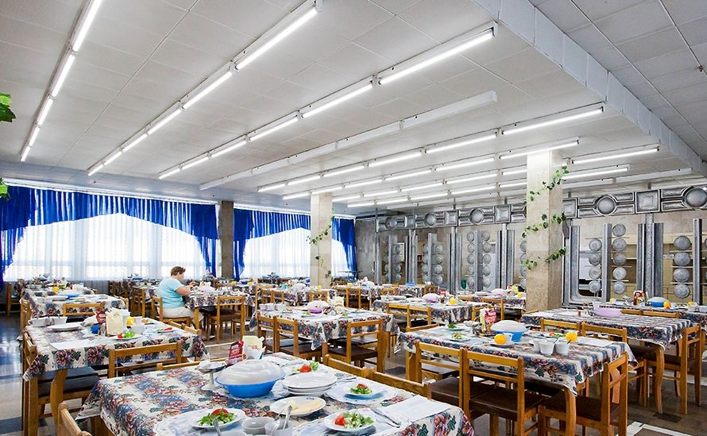
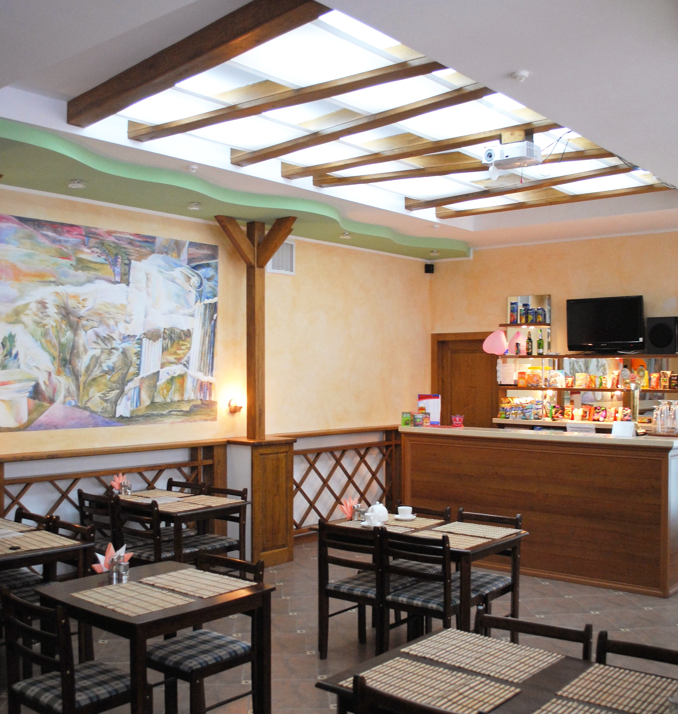
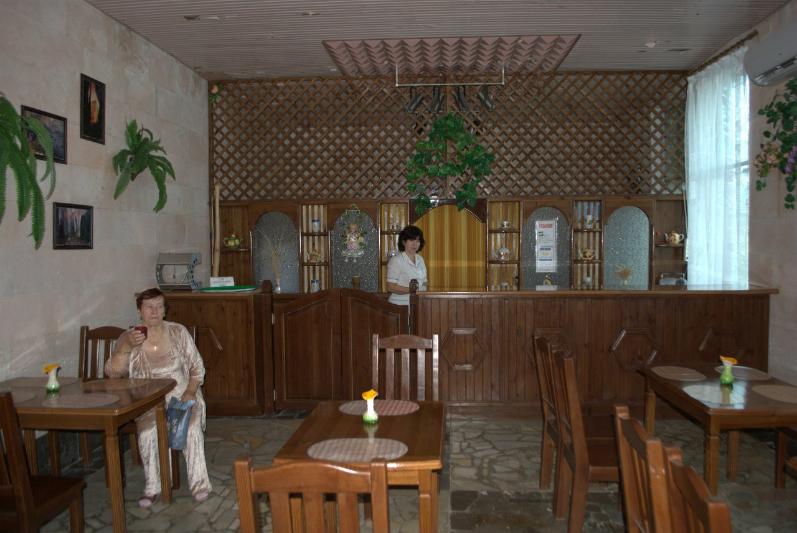

#Питание

Питание отдыхающих осуществляется в кондиционируемых, уютных залах столовой пансионата, по заказному, диетическому и вегетарианскому меню. Питание калорийное сбалансированное 4-х разовое заказное. Все продукты обеспечены санитарно-гигиеническими сертификатами и экологически благополучны.

Питание осуществляется в столовой санаторного комплекса.

Столовая представлена просторным светлым помещением, способным разместить львиную долю постояльцев здравницы. За прямоугольными столами могут есть от четырех до шести человек. В меню представлены блюда европейской кухни, чаще всего русской. Преобладают изделия из мяса, рыбы, птицы, гарниры, салаты, холодные закуски и десерты. В качестве напитков – чай, кофе и какао. Есть возможность индивидуального заказа на деликатесы или соки.
А те, кто пожелают перекусить или просто выпить чашечку кофе с утра, могут отведать его в кафе, которое работает на территории комплекса.

С учетом санаторного направления там же есть фито-бар, в меню которого только здоровая пища.
В меню фито-бара разнообразная пища: салаты, свежие овощи и фрукты, полезные десерты, свежевыжатые соки, кислородные коктейли и чаи с различными лечебными травами. К отдыху и оздоровлению располагает и атмосфера, которая царит в баре. Есть возможность приготовления напитка по индивидуальному рецепту.

