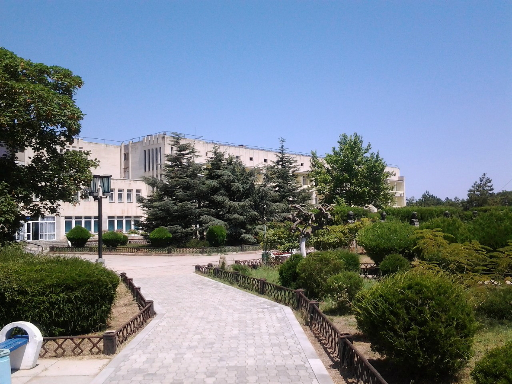
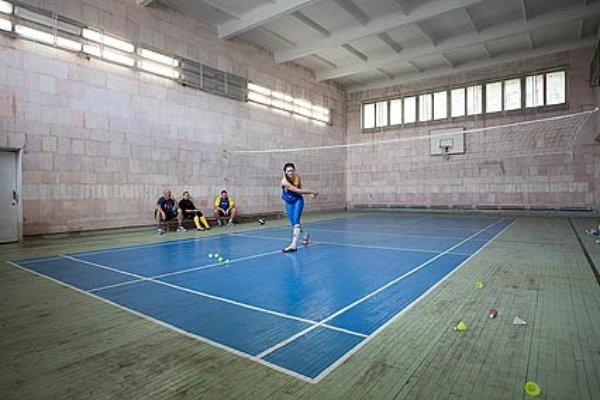
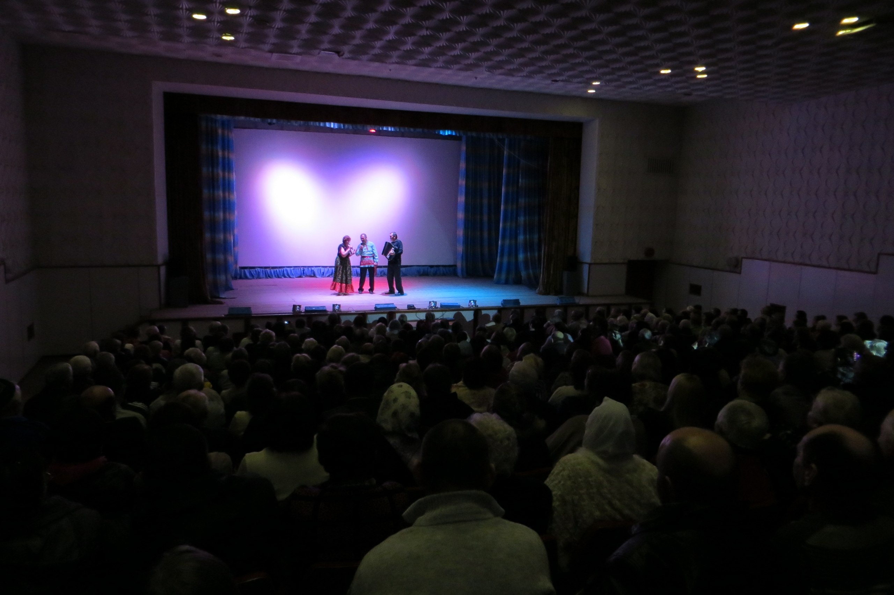

# Спорт и досуг

В санатории созданы прекрасные условия для спортивных занятий и развлекательного досуга всех отдыхающих. Впечатляет обширная территория здравницы, с красивейшими цветниками и вековыми деревьями.

В тени этой природной роскоши постояльцы могут поиграть в волейбол и баскетбол, для этого обустроены соответственные площадки.

## Футбольное поле
Санаторий располагает футбольным полем, внушительные размеры которого составляют 90х54 м. Наличие мощного электрического освещения позволяет проводить корпоративные матчи и профессиональные тренировки футбольных коллективов как днем, так и в вечернее время. Покрытие стадиона – искусственный газон от канадской компании Field Turf. Все постояльцы могут в удовольствие играть на поле.

  
    
      <a href="{{ image.url }}">  {{ image.cropZoom(200, 150) }} </a>   
        
  

## Бассейн
К услугам постояльцев крытый бассейн, главное преимущество которого выражается в наличие специально обогащенной минералами воды. Это позволяет не только с удовольствием плескаться в бассейне, но и получить полный комплекс оздоровительных процедур.

  
    
      <a href="{{ image.url }}">  {{ image.cropZoom(200, 150) }} </a>   
        
  

Гости имеют возможность посещать библиотеку, тренажерный и спортивный зал.
## Тренажерный зал

  
    
      <a href="{{ image.url }}">  {{ image.cropZoom(200, 150) }} </a>   
        
  

Помещение тренажерного зала санатория, который приглашает всех постояльцев позаниматься в уютной атмосфере, представляет собой комфортабельное, удлиненное помещение с хорошим освещением и всеми необходимыми приспособлениями для спорта. Беговая дорожка, силовые и кардиотренажеры, велотрек, скамьи для прокачки пресса, штанги и гантели – все это в свободном доступе для гостей здравницы.  

## Спортзал

По вечерам в кинозале проводятся показы новых кинофильмов, которые только выставлены в прокат, дети имеют возможность смотреть любимые мультфильмы.

